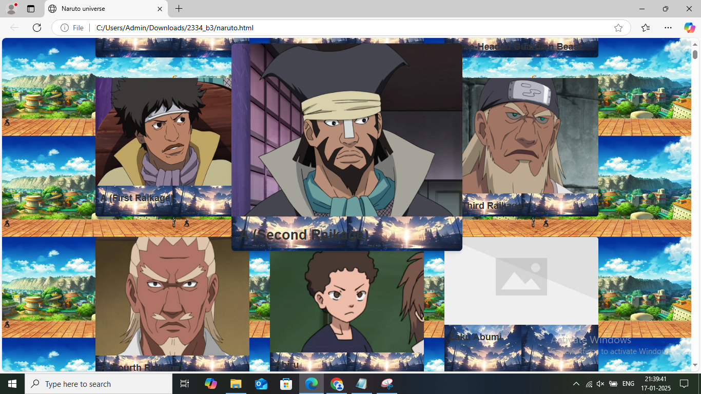

# 🎯 Naruto Universe - Character Database

## 📜 Project Description
The **Naruto Universe** project is a web-based application that fetches character data from the **Naruto Database API** and displays it in an interactive interface. Users can view character details, including images, debut information, jutsu, personal traits, and unique traits. The application also provides a search functionality to filter characters by jutsu, and users can navigate between characters using next and previous buttons.

The application was built using **HTML**, **CSS**, and **JavaScript**. It fetches data from the **Naruto Database API** and allows users to explore characters from the Naruto universe in an engaging and interactive manner.

---
### ✨ Features:
- ** 📷 Character Display:** View images and details of various characters.
- ** 🔍 Search Functionality:** Search for characters by jutsu.
- ** 🧑‍🤝‍🧑 Pagination:** Navigate through character pages using next and previous buttons.
- ** 🌐 Responsive Design:** The web application is designed to work across different devices and screen sizes.
- ** 🎮 Interactive Modal:** Clicking on a character card opens a detailed view with more information about that character.

---
## ⚙️ Installation Instructions

### 🛠️ 1. Setup Instructions
1. Clone the repository or download the project files.
2. Ensure that the required files images are in the same directory.
3. Open the `index.html` file in a browser to start using the application.

### 🌐 2. API Access
This project fetches data from the **Naruto Database API**. It doesn't require a local database setup, as the data is fetched dynamically from the remote API.

## 🛡️ Usage

### 🌟 1. Viewing Characters
Once the webpage is loaded:
1. You will see a list of character cards.
2. Clicking on any character card will open a modal with more detailed information about the character, including their images, debut, jutsu, personal traits, and unique traits.

### 🔍 2. Searching for Jutsu
To search for characters with specific jutsu:
1. Enter the jutsu name in the search input field at the top of the page.
2. Click the "Search" button.
3. The character list will be filtered to show only those who have the searched jutsu.

### 🔄 3. Resetting the Search
To reset the search and view all characters again:
1. Click the "Reset" button next to the search input field.

### ⏩ 4. Navigating Between Characters
Once a character's details are displayed in the modal:
1. You can use the left and right arrows to navigate to the previous or next character.
2. The navigation arrows are hidden when you're at the first or last character.

## 🛠️ Technologies Used
- **HTML** (for structuring the web page)
- **CSS** (for styling and creating the responsive layout)
- **JavaScript** (for fetching data from the Naruto Database API and adding interactivity)
- **API**: **Naruto Database API** (for fetching character information)
  

## ✨ Screenshots
1. **Homepage:**
   
   
2. **Character Card:**
   

3. **Modal View:**
   

4. **Search Results:**
   

---
## ⚠️ Notes
- The API used for fetching data (`https://narutodb.xyz/api/character`) does not require an API key and is publicly available for this project.
- Ensure your browser allows loading of external resources (images and scripts) for full functionality.

